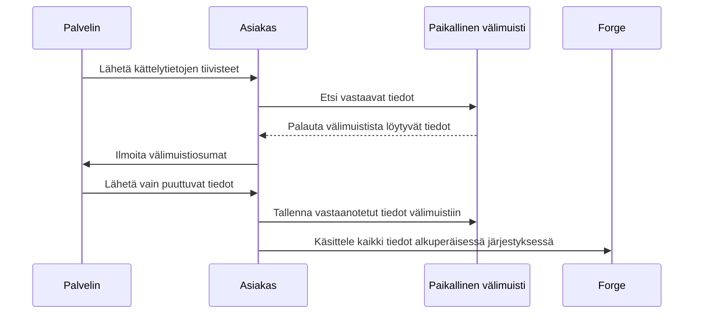

[English](README.md) | [Suomi](README.fi.md)

*Käännös on tehty GPT-5.6:n avustuksella.*

# handshake-cache

Tallentaa Forgen kirjautumiskättelyn tiedot välimuistiin, jotta samoja tietoja tarvitsee siirtää vähemmän, kun palvelimelle yhdistetään uudelleen.

Kohdeversio on Minecraft 1.18.2. Projekti käyttää Forge-versiota 40.1.44 ja Java 17:ää.

## Toimintaperiaate

Palvelin lähettää ensin luettelon kättelytietojen tiivisteistä. Asiakas tarkistaa paikallisen välimuistinsa ja ilmoittaa, mitkä tiedot sillä jo on. Palvelin siirtää vain puuttuvat tiedot, ja asiakas välittää välimuistista luetut ja juuri vastaanotetut tiedot Forgelle alkuperäisessä järjestyksessä.

Ensimmäinen yhteys täyttää välimuistin. Myöhemmillä yhteyskerroilla voidaan käyttää uudelleen tietoja, joiden sisältö ei ole muuttunut. Jos asiakkaalla ei ole modia asennettuna, palvelin käyttää tavallista kättelyä.



## Asennus

Kopioi käännetty modin JAR-tiedosto sekä asiakkaan että palvelimen `mods/`-hakemistoon. Käynnistä sitten peli ja palvelin. Välimuistin käyttö edellyttää modin asentamista molemmille puolille.

Asiakas tallentaa välimuistin työhakemiston `handshake_cache/`-alihakemistoon.

## Asetukset

Seuraavat asetukset ovat asiakkaan asetustiedostossa:

| Asetus | Oletusarvo | Tarkoitus |
|---|---|---|
| `max-size` | `67108864` (64 MiB) | Välimuistin enimmäiskoko tavuina |
| `expire-duration` | `PT720H` (30 päivää) | Aika viimeisestä käyttökerrasta tietojen vanhenemiseen |
| `manage-duration` | `PT5M` (5 minuuttia) | Välimuistin ylläpitoväli |

Ajanjaksot ilmoitetaan ISO 8601 -muodossa. Esimerkiksi `PT12H` tarkoittaa 12 tuntia. Ylläpito poistaa vanhentuneet tiedot. Jos kokoraja ylittyy, ensin poistetaan tiedot, joiden viimeisestä käyttökerrasta on kulunut pisin aika.

## Keskeiset osat

Java-lähdekoodi sijaitsee hakemistossa `src/main/java/io/github/runjief/handshakecache/`.

| Tiedosto tai hakemisto | Tehtävä |
|---|---|
| `HandshakeCacheMod.java` | Modin aloituspiste; rekisteröi viestintäkanavan ja asiakkaan asetukset |
| `mixin/HandshakeHandlerMixin.java` | Liittää välimuistin Forgen kättelyyn ja muokkaa lähetettäviä tietoja välimuistiosumien perusteella |
| `mixin/ServerboundCustomQueryPacketMixin.java` | Ohjaa asiakkaan tyhjän vastauksen tiivisteluetteloon tälle modille; näin palvelin tunnistaa asiakkaan, jolla ei ole modia |
| `packet/ServerHandler.java` | Muodostaa kättelytietojen tiivisteet ja käsittelee asiakkaat, joilla ei ole modia |
| `packet/ClientHandler.java` | Lukee ja tallentaa välimuistitietoja sekä käsittelee välimuistista luetut ja vastaanotetut tiedot järjestyksessä |
| `cache/FileBasedRepo.java` | Hallitsee levyllä olevaa välimuistia, hakemistoindeksiä, vanhenemista ja kokorajaa |
| `packet/HandshakeCacheChannel.java`, `packet/login/` | Määrittelevät viestintäkanavan sekä tiiviste-, välimuistiosuma- ja tiedonsiirtoviestit |
| `HandshakeCacheConfig.java` | Määrittelee välimuistin koon, vanhenemisajan ja ylläpitovälin |
| `HandshakeCacheHandles.java` | Kapseloi Forgen sisäisten kättelyrajapintojen käytön |

## Kääntäminen

Edellyttää Java 17:ää. Projekti sisältää Gradle Wrapperin.

Windows:

```powershell
.\gradlew.bat build
```

Linux / macOS:

```sh
./gradlew build
```

Käännöstulokset tallennetaan hakemistoon `build/libs/`.

## Lisenssi

GPL-3.0. Katso [LICENSE](LICENSE).
