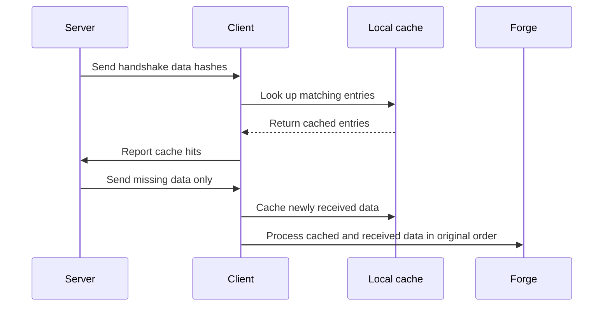

[English](README.md) | [Suomi](README.fi.md)

# handshake-cache

Caches Forge login handshake data to reduce repeated transfers when reconnecting to a server.

Targets Minecraft 1.18.2 and uses Forge 40.1.44 and Java 17.

## How it works

The server first sends a list of handshake data hashes. The client checks its local cache and reports which entries it already has. The server transfers only the missing data, and the client passes cached and newly received data to Forge in the original order.

The first connection populates the cache. Later connections can reuse data whose contents have not changed. If the client does not have the mod installed, the server falls back to the standard handshake.



## Installation

Place the built mod JAR in the `mods/` directory on both the client and the server, then start the game and server. Both sides need the mod to use caching.

The client stores its cache in `handshake_cache/` under the working directory.

## Configuration

These options are available in the client configuration:

| Option | Default | Purpose |
|---|---|---|
| `max-size` | `67108864` (64 MiB) | Maximum cache size in bytes |
| `expire-duration` | `PT720H` (30 days) | Time after the last access before an entry expires |
| `manage-duration` | `PT5M` (5 minutes) | Cache maintenance interval |

Durations use ISO 8601 notation, such as `PT12H` for 12 hours. Cache maintenance removes expired entries. When the size limit is exceeded, entries that have not been accessed for the longest time are removed first.

## Main components

Java sources are under `src/main/java/io/github/runjief/handshakecache/`.

| File or directory | Role |
|---|---|
| `HandshakeCacheMod.java` | Mod entry point; registers the communication channel and client configuration |
| `mixin/HandshakeHandlerMixin.java` | Hooks into the Forge handshake and adjusts outgoing data based on cache hits |
| `mixin/ServerboundCustomQueryPacketMixin.java` | Routes a client's empty reply to the hash list to this mod, which is how the server detects a client without the mod |
| `packet/ServerHandler.java` | Generates handshake data hashes and handles clients without the mod |
| `packet/ClientHandler.java` | Reads and stores cache entries, and processes cached and received data in order |
| `cache/FileBasedRepo.java` | Manages the disk cache, index, expiration, and size limit |
| `packet/HandshakeCacheChannel.java`, `packet/login/` | Define the communication channel and messages for hashes, cache hit replies, and data transfers |
| `HandshakeCacheConfig.java` | Defines cache capacity, expiration, and maintenance settings |
| `HandshakeCacheHandles.java` | Encapsulates access to Forge's internal handshake interfaces |

## Building

Requires Java 17. The project includes the Gradle Wrapper.

Windows:

```powershell
.\gradlew.bat build
```

Linux / macOS:

```sh
./gradlew build
```

Build artifacts are written to `build/libs/`.

## License

GPL-3.0. See [LICENSE](LICENSE).
